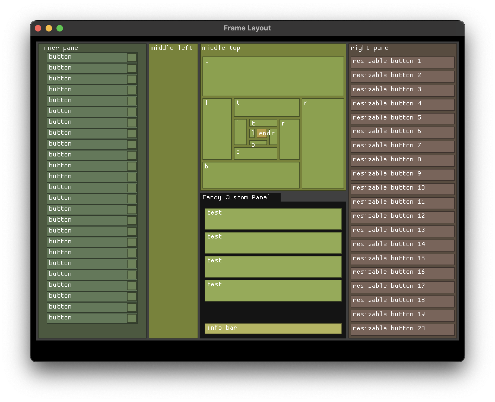

# Matte.rs

**_WARNING: Under heavy development, API changes constantly._**
------------------------------------------------------------------------

A minimalist **_immediate mode_**, **_no_std_** and **_no allocations_** layout library for rectangular elements (Frames), intended for games, embedded systems, and other constrained environments. **Matte does not perform any rendering**, it simply lays out nested rectangles (Frames) with margins and gaps between children.

While easy to use, Matte's approach is very limited and can't create complex layouts! There are a few key functions to work with:
- [Frame::push_edge()] inserts a new frame by pushing any edge inwards by a certain amount
- [Frame::push_size()] to add elements with specific dimensions (with automatic scaling)
- [Frame::fill_edge()] like push_edge, but with a ratio of the parent rect for the length
- [Frame::fill_size()] like push_size, but uses a ratio of the parent rect for w and h
- [Frame::place()] for arbitrary positioning

All these functions can operate from any side (Left, Right, Top, and Bottom). Repeatedly adding from the same side is analogous to using a "Row" or "Column" in a more complex GUI library.

It does not have any knowledge of fancy things like *rendering* and *input*. Instead, it provides you with closures that are aware of their parent Frame's rectangle and available space, and you do the rendering and input yourself.

It also does not know in advance the size of the children, so you may need to do the math yourself within the closure before adding children, although this is planned to be easier in the future. You can use the [Frame::cursor()] method to check the available space after margin is applied, or [Frame::rect()] to get the closure's rectangle.



Three examples are provided:
- *example_basic*, A very simple example using Macroquad for rect rendering.
- *example_mquad*, a more complex layout using Macroquad with text and adjustable zoom.
- *example_sdl*, which uses SDL2 (via the mini_sdl crate).

## Usage Example

```rust
use matte::{Frame, Rect, Fitting, Edge::*, Align::*};

fn main() {
    // Create a root frame
    let mut root = Frame::new(Rect {
        x: 0,
        y: 0,
        w: 800,
        h: 600,
    });

    // Optionally set fitting mode to automatically scale elements
    root.fitting = Fitting::Scale;

    // Add a header at the top
    root.push_edge(Top, 100, |header| {
        // Add a logo to the left of the header
        header.push_edge(Left, 200, |logo| {
            // You can acquire this rectangle using logo.rect(),
            // and draw it with your favorite graphics crate.
        });

        // Add navigation buttons to the right
        header.push_edge(Right, 200, |nav| {
            // Navigation content
            for _ in 0..10 {
                nav.push_edge(Top, 40, |button| {
                    // This "button" is a smaller rect within nav, stacked from the top
                })
            }
        });
    });

    // Add a dynamic sidebar using 20% of the remaining space (ratio = 0.2)
    root.fill_edge(Left, 0.2, |sidebar| {
        // Sidebar content
    });

    // Add a centered element with specific dimensions (will scale if needed)
    root.push_size(Center, 300, 200, |centered_element| {
        // Centered content that will scale to fit if necessary
    });

    // Main content area (use remaining space with ratio = 1.0)
    root.fill_edge(Left, 1.0, |content| {
        // Place an element at specific coordinates with automatic scaling
        content.place(LeftTop, 50, 50, 400, 300, |placed_element| {
            // Element content that scales to fit available space
        });
    });
}
```

## Features

- **Immediate Mode**: Simple and direct with minimal setup.
- **No Standard Library Dependencies**: Works in embedded environments with `no_std`
- **Nested Layouts**: Create hierarchical frame structures
- **Flexible Positioning**: Add child frames to any side (left, right, top, bottom)
- **Margin & Gap Control**: Fine-tune spacing between elements
- **Proportional Layouts**: Allocate space by ratio with the `fill()` method
- **Adaptive Scaling**: Automatically scale elements to fit available space with aspect ratio preservation
- **Smart Fitting**: Multiple strategies for handling elements that exceed available space:
  - `Relaxed`: Allows overflow
  - `Aggressive`: Removes elements that exceed boundaries
  - `Clamp`: Resizes elements to fit available space
  - `Scale`: Scales elements to fit while preserving aspect ratio
- **Centered Elements**: Position elements in the center with `center()` and `center_fill()`
- **Precise Placement**: Position elements at exact coordinates with `place()`
- **Scaling Support**: Adjust all elements with a scale factor
- **Generic Numeric Support**: Works with various numeric types (u16, f32, etc.)

## License

MIT License
